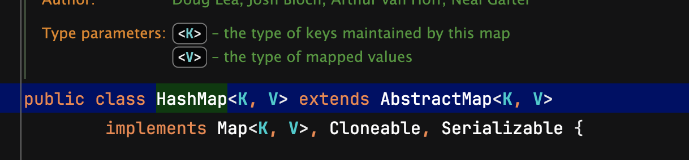

# Generic

## **Q. 자바의 Generic에 대해 아시는데로 말씀해주세요.**

자바 제네릭(Generic)은 클래스나 메서드를 작성할 때 데이터 타입을 미리 지정하지 않고, 사용할 때 타입을 지정할 수 있게 해주는 기능입니다. 제네릭을 사용하면 코드 재사용성이 높아지고, 컴파일 시 타입 안전성을 확보할 수 있습니다.

이러한 제네릭은 자료구조와 연관되어 있습니다. 자바의 List, Set, Map 등의 자료구조 클래스는 제네릭을 활용하여 다양한 타입의 데이터를 다룰 수 있도록 설계되어있습니다.


## **Q. 그렇다면 Set자료구조에서 Generic은 구체적으로 어떻게 사용되나요?**

Set은 중복되지 않은 요소들의 집합을 나타내는 자료구조입니다. 여기에 제네릭을 적용하면 Set에 저장되는 요소의 타입을 명확하게 지정할 수 있습니다. 즉, 특정 타입의 객체만 저장하도록 제한할 수 있습니다. 예를들어, A라는 변수에 String만 저장되는 Set 자료구조를 만들고 싶다면 `Set<String> A` 라는 형식으로 생성하는 식 입니다.


## **Q. Object를 사용하면 String을 포함한 모든 타입을 다 저장할 수 있을텐데, Generic를 꼭 써야하는 이유가 있나요?**

Object를 사용하면 데이터를 꺼낼 때 Object 타입으로 꺼내지게 되고, 추가적인 작업을 위해서 형 변환이 필수 입니다. 여기서 발생되는 문제로, 만약 추가적인 작업이 Integer 타입으로 짜여져있을때 값이 String 타입이면 에러가 발생합니다. 따라서, 추가적인 형변환 없이 명확하게 원하는 타입만 저장하기 위해 Generic은 필수 입니다.


## **Q. 추가로 와일드카드에 대해서 설명해주세요.**

제네릭 와일드카드는 제네릭 타입에서 특정 타입을 명시하지 않고, 어떤 타입이 올 수 있는지에 대한 제약을 표현하는 방법입니다. 마치 정규 표현식에서 와일드카드 문자(`*`)가 어떤 문자든지 대표하는 것처럼, 제네릭에서도 와일드카드(`?`)가 다양한 타입을 나타냅니다. 와일드카드의 종류로는 비제한 와일드카드, 상한 제한 와일드카드, 하한 제한 와일드카드 가 있습니다.


***

> **추가 내용**

## Q. 자바 프로그램이 동작할 때 제네릭은 어떻게 작동하나요? (원시타입으로 제네릭을 쓰는건 왜 안되나요?)

우리가 자바에서 코드를 작성할 때는 제네릭 타입을 사용하지만, 실제로 컴파일되어 실행할 때는 이 타입 정보가 제거 됩니다. 이것을 타입 소거(Type Erasure)라고 합니다.

이것은 자바의 하위 호환성 때문입니다. Java5에서 제네릭이 도입됐을 때, 이전 버전의 코드들과 호환성을 유지하면서도 새로운 기능을 추가해야 했기 때문입니다. 그래서 실제로 JVM이 실행할 때는 제네릭 타입 정보가 전부 Object로 변환되고, 필요한 곳에서 자동으로 형변환이 일어납니다. 이때 컴파일러가 미리 타입 체크를 해주기 때문에, 실행 시점에서 형변환 오류가 발생하지는 않습니다. 또한 원시타입은 형변환이 불가능 하므로 제네릭으로 원시 타입을 직접 사용할 수는 없습니다.

**예시 코드**

```java
// 우리가 작성한 코드
ArrayList<String> list = new ArrayList<>();
list.add("Hello");
String str = list.get(0);

// 컴파일 후 실제 실행되는 코드
ArrayList list = new ArrayList();
list.add("Hello");
String str = (String) list.get(0);
```


## 이론 정리

### 1. 자바의 Generic과 컬렉션 프레임워크

일반적으로 클래스를 만들 때 아래와 같은 형식으로 만듭니다.

```java
class Box {
    private Object item;
    
    public void setItem(Object item) {
        this.item = item;
    }
    
    public Object getItem() {
        return item;
    }
}
```

여기서 Generic을 쓴다면 이렇게 쓸 수 있습니다.

```java
class Box<T> {
    private T item;
    
    public void setItem(T item) {
        this.item = item;
    }
    
    public T getItem() {
        return item;
    }
}
```

이렇게 했을 때 장점

1. 코드를 재사용하기 쉬워집니다. item으로 String을 담고 싶으면 `Box<String>`으로, Integer를 담고 싶다면 `Box<Integer>`로 쓸 수 있습니다.
2. 컴파일할 때 타입을 체크해주기 때문에 실수로 다른 타입의 데이터를 넣으려고 하면 바로 에러가 발생합니다. (타입 안정성)

실제로 자바의 ArrayList나 HashMap같은 컬렉션 프레임워크들도 전부 이 제네릭을 사용해서 만들어져 있습니다. 그래서 우리가 `ArrayList<String>`이나 `HashMap<String, Integer>` 이런 식으로 쓸 수 있는 거죠.

<figure><figcaption></figcaption></figure>

### **Object와 Generic**

Object의 경우 아래와 같이 사용합니다.

```java
List numbers = new ArrayList();
numbers.add("1"); // String 추가
numbers.add(2);   // Integer 추가

// 데이터를 사용할 때
Object firstElement = numbers.get(0);
int value = (Integer) firstElement; // RuntimeException 발생! String을 Integer로 변환 불가
```

이렇게 Object를 사용하면 두 가지 문제가 있습니다.

1. 타입 안정성 문제 - 컴파일 시점에 타입 오류를 잡을 수 없고 실행 시점(런타임)에 가야 오류가 발생해서 잡기 힘듬
2. 형변환의 번거로움 - 데이터를 꺼낼 때마다 매번 형변환을 해줘야 함

반면에 Generic을 사용하면

```java
List<Integer> numbers = new ArrayList<>();
numbers.add(1);    // OK
numbers.add("2");  // 컴파일 에러! String은 추가 불가

// 데이터를 사용할 때
int firstNumber = numbers.get(0); // 자동으로 Integer 타입으로 인식, 형변환 불필요
```

List의 타입을 Integer로 지정을 해줬기 때문에, 컴파일 시점에 타입 체크가 가능하고 형변환이 필요가 없게 됩니다.


### 와일드카드

```
// 비제한 와일드카드(<?>) - 모든 타입이 올 수 있음
List<?> list = new ArrayList<String>();
List<?> list2 = new ArrayList<Integer>();

// 상한 제한 와일드카드(<? extends Type>) - Type이나 Type의 자식 클래스만 올 수 있음
List<? extends Number> list = new ArrayList<Integer>();
List<? extends Number> list2 = new ArrayList<String>(); // 컴파일 에러

// 하한 제한 와일드카드(<? super Type>) - Type이나 Type의 부모 클래스만 올 수 있음
List<? super Integer> list = new ArrayList<Number>();
List<? super Integer> list2 = new ArrayList<Double>(); // 컴파일 에러
```
